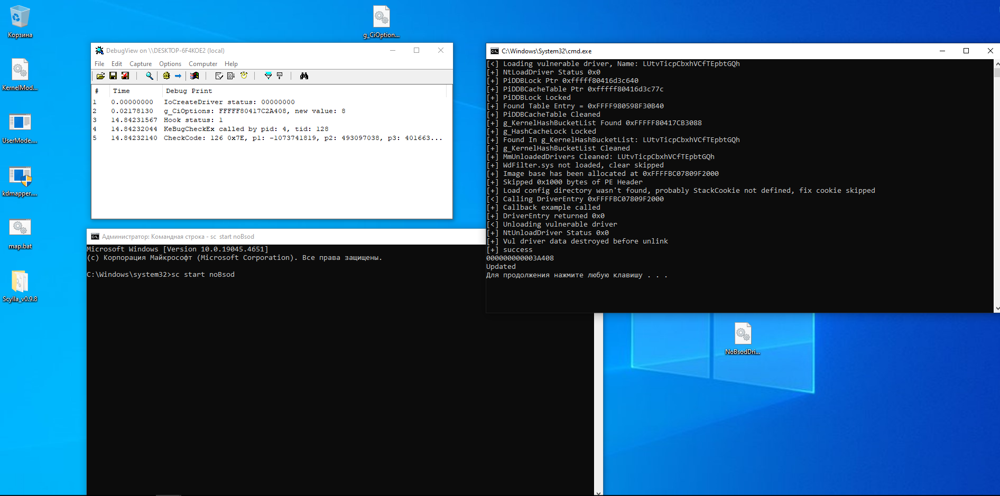

# DseDisabler
Disabler for Driver Signature Enforcement

### Features list
- [X] Patching g_CiOptions using ring0 driver
- [ ] Patching using UEFI (Not planned)
- [X] Not IOCTL communication

### Usage
Driver supports Manual mapping, so you can use for example [kdmapper](https://github.com/TheCruZ/kdmapper) for mapping driver or just create it using new service (but you need to sign it):
```
sc create dse type=kernel binPath=<path/to/KernelMode.sys>
sc start dse
```
After that start UserMode.exe with `disable` or `enable` arguments.

### Bypassing PatchGuard
Now CI.dll is protected by PatchGuard, to bypass it you have many ways:
- Load NoBsodDriver (Very meme way)
- Disable PatchGuard for example using [EfiGuard](https://github.com/Mattiwatti/EfiGuard)
- After your manipulations, turn DSE back off

### Pictures


### Credits
- [vergiliusproject](https://www.vergiliusproject.com/kernels/x64/windows-10) for Windows opaque structures
- [FindCiOptions](https://github.com/CaledoniaProject/FindCiOptions) for DONT_RESOLVE_DLL_REFERENCES flag to load CI.dll using LoadLibraryEx
